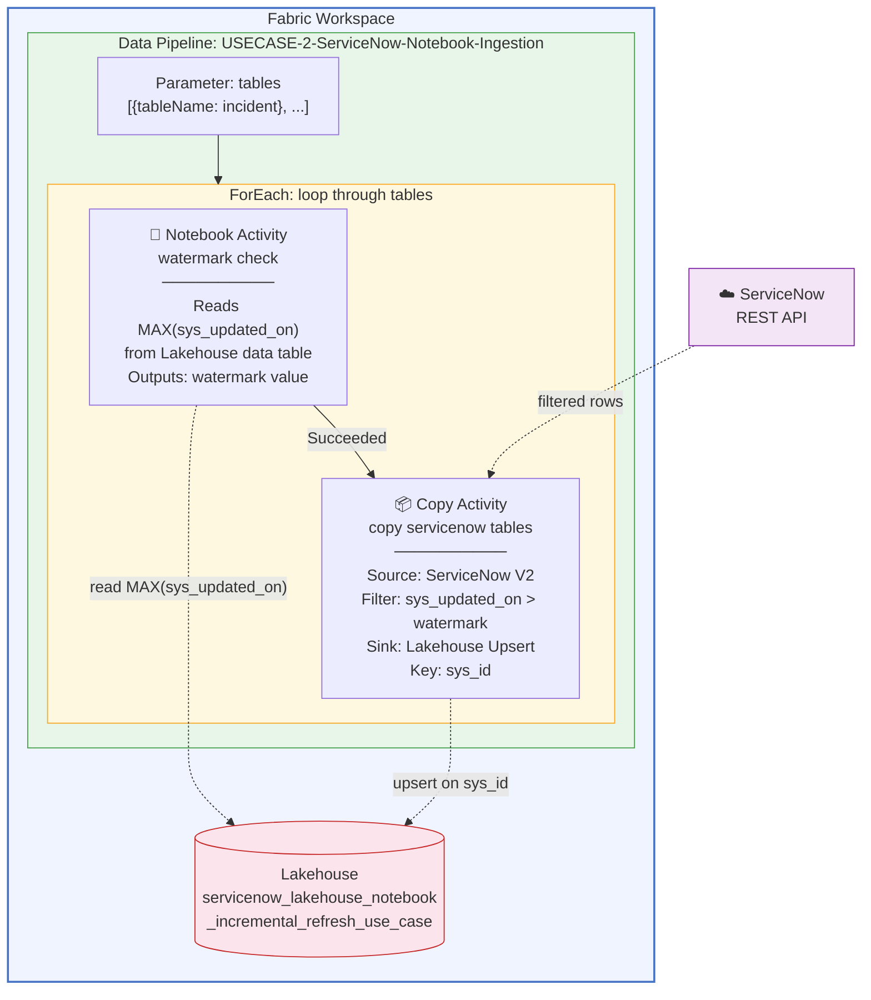
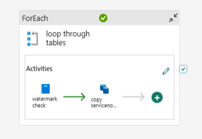

# ServiceNow → Microsoft Fabric Incremental Ingestion Pipeline (Notebook + Copy Activity)

Incremental ingestion from ServiceNow into a Fabric Lakehouse using a **hybrid Notebook + Copy Activity** pattern. A PySpark notebook reads the maximum `sys_updated_on` timestamp directly from the Lakehouse data table and passes it to a Copy Activity, which pulls only new/changed records from ServiceNow.

**Notebook for watermark logic. Copy Activity for data movement. No SQL Database required. No separate watermark table. Two activities per table.**

---

## Architecture



### Pipeline Flow (per table, inside ForEach)



| Step | Activity | What It Does |
|---|---|---|
| 1 | **watermark check** (Notebook) | Reads `MAX(sys_updated_on)` from the Lakehouse data table, outputs the watermark value via `mssparkutils.notebook.exit()` |
| 2 | **copy servicenow tables** (Copy Activity) | Copies rows from ServiceNow where `sys_updated_on > watermark` (strictly greater than), upserts into the Lakehouse on `sys_id` |

> **Key insight:** There is no separate watermark tracking table. The watermark is derived directly from the data — `MAX(sys_updated_on)` on the target table. This is simpler and self-maintaining.

---

## How It Differs from the SQL Database Watermark Approach

This repo is one of two ServiceNow ingestion patterns. For the companion approach, see [fabric-pipeline-servicenow-incremental-refresh](https://github.com/claraworkman/fabric-pipeline-servicenow-incremental-refresh).

| Feature | This Repo (Notebook + Copy Activity) | Companion Repo (SQL Database + Copy Activity) |
|---|---|---|
| **Watermark storage** | Derived from data table (`MAX(sys_updated_on)`) | Fabric SQL Database |
| **Watermark logic** | PySpark Notebook | Lookup + Stored Procedure |
| **Data movement** | Copy Activity (ServiceNow V2 connector) | Copy Activity (ServiceNow V2 connector) |
| **Activities per table** | 2 (Notebook → Copy) | 3 (Lookup → Copy → Stored Procedure) |
| **Extra infrastructure** | None | SQL Database + stored procedure |
| **Separate watermark table** | No — reads directly from data | Yes — `watermark_tracking` table |
| **Customization** | Notebook code — fully extensible | Pipeline expressions only |
| **Compute** | Spark session + pipeline runtime | Pipeline runtime only |
| **Best for** | Teams comfortable with PySpark, want extensibility | Teams wanting pure low-code, fastest execution |

---

## What's in This Repo

The `main` branch contains Fabric Git Integration exports:

| Folder | Fabric Item | Purpose |
|---|---|---|
| `USECASE-2-notebook-watermark-tracker.Notebook/` | Notebook | Reads watermark from data table, outputs to pipeline |
| `ServiceNow-Incremental-Ingestion-Pipeline-Notebook-Method.DataPipeline/` | Data Pipeline | ForEach → Notebook → Copy Activity |

---

## Prerequisites

| Requirement | Details |
|---|---|
| **Fabric workspace** | With Fabric capacity attached (F2 or higher; trial capacity also works) |
| **Fabric Lakehouse** | Created during setup or imported via Git Integration |
| **ServiceNow instance** | Developer or production instance with REST API access |
| **ServiceNow auth** | Service account with Basic authentication |
| **Workspace role** | Contributor or higher |

---

## Deployment

> **At a glance — 5 steps:**
> 1. Create a Fabric workspace and Lakehouse
> 2. Create the watermark notebook
> 3. Create the data pipeline with ForEach → Notebook → Copy Activity
> 4. Create the ServiceNow connection
> 5. Test the pipeline
>
> **Or** connect your Fabric workspace to the `main` branch via Git Integration to import all items at once.

### Step 1: Create a Fabric workspace and Lakehouse

1. Go to [app.fabric.microsoft.com](https://app.fabric.microsoft.com) → **Workspaces** → **+ New workspace**
2. Name it (e.g., `ServiceNow-Notebook-Ingestion`)
3. Assign a Fabric capacity (F2 or higher; trial capacity also works)
4. Inside the workspace, click **+ New item** → **Lakehouse** → name it `servicenow_data`

### Step 2: Create the watermark notebook

The notebook derives the watermark from the data table itself — no separate tracking table needed.

1. In the workspace, click **+ New item** → **Notebook**
2. Name it `USECASE-2-notebook-watermark-tracker`
3. Attach it to your Lakehouse (click **Lakehouses** in the left panel → **Add** → select your Lakehouse)
4. Add the following cells:

#### Cell 1 — Parameters

```python
# Parameter injected by the pipeline ForEach activity
table_name = "incident"
```

> **Note:** When triggered by the pipeline, `table_name` is overridden by the Notebook activity's base parameter (`@item().tableName`). The `"incident"` default here is used when running the notebook interactively for testing.
>
> **If you import via Git Integration:** The exported pipeline JSON does not include the notebook base parameter mapping. After import, open the Notebook activity → **Settings** → **Base parameters** and add: Name = `table_name`, Type = String, Value = `@item().tableName`.

#### Cell 2 — Read watermark and output to pipeline

```python
from datetime import datetime

df = spark.sql(f"SELECT MAX(sys_updated_on) AS watermark FROM {table_name}")
watermark = df.collect()[0]["watermark"]

if watermark is None:
    result = "1970-01-01 00:00:00"
else:
    result = str(watermark)

mssparkutils.notebook.exit(result)
```

> **How it works:**
> - Queries `MAX(sys_updated_on)` from the Lakehouse data table (e.g., `incident`)
> - If the table doesn't exist yet (first run), the watermark is `None` and defaults to `1970-01-01 00:00:00` (full load)
> - Outputs the watermark via `mssparkutils.notebook.exit()` so the Copy Activity can use it
> - The Copy Activity reads the value with: `@activity('watermark check').output.result.exitValue`
> - The Copy Activity uses strictly greater than (`>`) to avoid re-reading the last ingested record

### Step 3: Create the data pipeline

1. In the workspace, click **+ New item** → **Data Pipeline**
2. Name it `USECASE-2-ServiceNow-Notebook-Ingestion`

#### Add the pipeline parameter

- Name: `tables`
- Type: Array
- Default: `[{"tableName": "incident"}]`

#### Add the ForEach activity

1. Drag a **ForEach** activity onto the canvas
2. Name it `loop through tables`
3. **Settings** → Items: `@pipeline().parameters.tables`
4. Click the **pencil icon** (✏️) to open the ForEach canvas

#### Inside the ForEach — add the Notebook activity

1. Drag a **Notebook** activity onto the ForEach canvas
2. Name it `watermark check`
3. **Settings**:
   - Notebook: select `USECASE-2-notebook-watermark-tracker`
   - Base parameters → **+ New**:
     - Name: `table_name`
     - Type: String
     - Value: `@item().tableName`

#### Inside the ForEach — add the Copy Activity

1. Drag a **Copy Data** activity onto the ForEach canvas
2. Name it `copy servicenow tables`
3. Connect `watermark check` → `copy servicenow tables` (drag the green **Succeeded** arrow)
4. **Source** tab:
   - Connection: Create or select your ServiceNow connection
   - Table: select `incident`
   - Filter: Add a filter expression for incremental:
     - Field: `sys_updated_on`
     - Operator: `>` (after)
     - Value: `@activity('watermark check').output.result.exitValue`
5. **Destination** tab:
   - Connection: select your Lakehouse
   - Table: `@{item().tableName}`
   - Table action: **Upsert**
   - Key columns: `sys_id`

### Step 4: Create the ServiceNow connection

1. In the Copy Activity **Source** tab, click the connection dropdown → **+ New connection**
2. Configure:

| Field | Value |
|---|---|
| **Connection name** | `ServiceNow-Connection` |
| **Server URL** | `https://<your-instance>.service-now.com` |
| **Authentication** | Basic (or OAuth 2.0 if supported by your instance) |
| **Username** | Your ServiceNow service account |
| **Password** | Service account password |

> **Security best practice:** Avoid storing credentials directly. If your Fabric workspace supports it, use **Azure Key Vault** to store the ServiceNow password and reference it in the connection. For production workloads, prefer **OAuth 2.0** authentication over Basic auth when your ServiceNow instance supports it.

### Step 5: Test

1. Click **Run** on the pipeline
2. First run → full load (all rows from ServiceNow, since watermark defaults to `1970-01-01`)
3. Second run → **0 rows copied** (incremental working — watermark is now set to latest `sys_updated_on`)
4. Update a record in ServiceNow → third run picks up the changed row

---

## Scaling to Multiple Tables

### 1. Update the pipeline parameter

No seeding needed — the notebook auto-detects if the table exists. If it doesn't, it returns `1970-01-01 00:00:00` for a full load.

```json
[
  {"tableName": "incident"},
  {"tableName": "change_request"},
  {"tableName": "cmdb_ci_server"},
  {"tableName": "sc_request"}
]
```

### 2. Run

The ForEach executes tables sequentially. Each table runs its own Notebook → Copy Activity chain in order.

> **Note:** The pipeline source table is already parameterized as `@{item().tableName}` — no manual changes needed for multi-table support.

---

## Key Design Decisions

### Why derive watermark from the data table?

Instead of maintaining a separate `watermark_tracking` table, the notebook reads `MAX(sys_updated_on)` directly from the target table. This means:
- **No initialization step** — first run auto-detects an empty/missing table and does a full load
- **Self-maintaining** — the watermark always reflects the actual data
- **No drift** — impossible for the watermark table to get out of sync with the data

### Why strictly greater than (`>`), not greater than or equal (`>=`)?

Using `>` instead of `>=` ensures the last ingested record is not re-read on every run. Since the watermark is the exact `MAX(sys_updated_on)` from the Lakehouse, `>=` would always re-copy that record. Strictly greater than skips it cleanly.

### Why Notebook + Copy Activity (hybrid)?

- **Notebook for watermark** — The Lakehouse Lookup activity only supports Table mode (T-SQL Query is greyed out), so you can't run `MAX(sys_updated_on)` with a Lookup. The notebook gives full Spark SQL access.
- **Copy Activity for data** — The native ServiceNow V2 connector handles authentication, pagination, and schema mapping automatically. No need to reimplement REST API calls in PySpark.

### Why Upsert on sys_id?

ServiceNow records can be updated. Using Append would create duplicate rows. Upsert performs a MERGE on `sys_id`, so:
- New records are inserted
- Modified records are updated in-place
- No duplicates

---

## Scheduling

Add a schedule trigger in the pipeline toolbar:

| Use Case | Recommended Frequency |
|---|---|
| Real-time ops dashboard | Every 15–30 minutes |
| Daily reporting | Once daily (e.g., 6:00 AM) |
| Weekly analytics | Once weekly |
| Development/testing | Manual trigger only |

---

## Troubleshooting

| Issue | Fix |
|---|---|
| Notebook output not accessible by Copy Activity | Ensure the notebook uses `mssparkutils.notebook.exit(watermark)` — Copy reads via `@activity('watermark check').output.result.exitValue` |
| Lakehouse Lookup query greyed out | This is why we use a Notebook instead of a Lookup for watermark reads |
| Copy reads all rows every run | Verify Source filter uses `@activity('watermark check').output.result.exitValue` as the value |
| Spark session slow to start | Normal — first notebook cell takes 30–60s for Spark initialization |
| Duplicate records | Ensure Destination table action is **Upsert** with key column `sys_id` |
| First run copies everything | Expected — the table doesn't exist yet, so watermark defaults to `1970-01-01` |
| ServiceNow connection fails | Check URL format (`https://<instance>.service-now.com`), auth type (Basic), account not locked |

---

## Useful Commands

```python
# Check the current watermark for a table (latest sys_updated_on)
display(spark.sql("SELECT MAX(sys_updated_on) AS watermark FROM incident"))

# Check row counts per table
for table in ["incident", "change_request", "cmdb_ci_server"]:
    try:
        count = spark.sql(f"SELECT COUNT(*) as cnt FROM {table}").collect()[0]["cnt"]
        print(f"{table}: {count} rows")
    except:
        print(f"{table}: not yet created")

# Preview recent records
display(spark.sql("SELECT sys_id, sys_updated_on FROM incident ORDER BY sys_updated_on DESC LIMIT 10"))
```

---

## Related

- **SQL Database watermark approach (3 native activities, no notebooks):** [fabric-pipeline-servicenow-incremental-refresh](https://github.com/claraworkman/fabric-pipeline-servicenow-incremental-refresh)

---

Disclaimer: The attached diagrams and code are provided AS IS without warranty of any kind and should not be interpreted as an offer or commitment on the part of Microsoft, and Microsoft cannot guarantee the accuracy of any information presented. MICROSOFT MAKES NO WARRANTIES, EXPRESS OR IMPLIED, IN THIS DIAGRAM(s) CODE SAMPLE(s).
