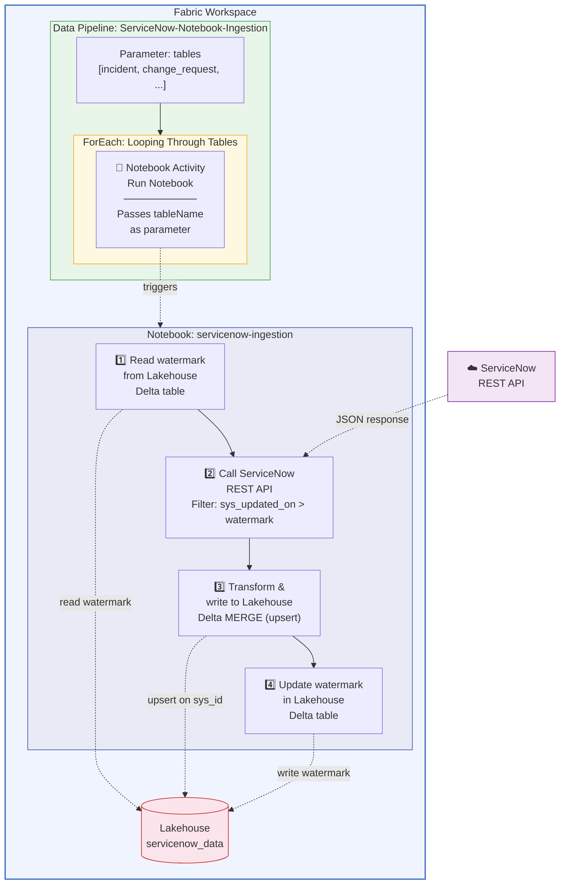

# ServiceNow → Microsoft Fabric Notebook-Driven Ingestion Pipeline

Incremental ingestion from ServiceNow into a Fabric Lakehouse using a **PySpark Notebook** orchestrated by a Fabric Data Pipeline. The notebook calls the ServiceNow REST API directly, handles pagination, transforms data, and writes to Lakehouse Delta tables with upsert logic.

**Notebook-driven. Full PySpark control. Custom transformation logic. Lakehouse-native watermark tracking.**

---

## Architecture



---

## How It Works

1. **Pipeline** receives a `tables` parameter (array of ServiceNow table names)
2. **ForEach** iterates over each table and triggers the notebook with `tableName` as a parameter
3. **Notebook** runs for each table:
   - Reads the last watermark (timestamp) from a `watermark_tracking` Delta table in the Lakehouse
   - Calls the ServiceNow Table API with `sysparm_query=sys_updated_on>{watermark}`
   - Handles pagination (ServiceNow returns max 10,000 rows per request)
   - Converts the JSON response to a Spark DataFrame
   - Performs a Delta MERGE (upsert) on `sys_id` into the target Lakehouse table
   - Updates the watermark in the tracking table

---

## Prerequisites

| Requirement | Details |
|---|---|
| **Fabric workspace** | With F64 or higher capacity attached |
| **Fabric Lakehouse** | Will be created during setup (e.g., `servicenow_data`) |
| **ServiceNow instance** | Developer or production instance with REST API access |
| **ServiceNow auth** | Service account with Basic authentication |
| **Workspace role** | Contributor or higher |

---

## Comparison: Notebook vs. Copy Activity Pipeline

This repo uses a **notebook-driven** approach. For a **no-code Copy Activity** approach, see the companion repo: [fabric-pipeline-servicenow-incremental-refresh](https://github.com/claraworkman/fabric-pipeline-servicenow-incremental-refresh).

| Feature | This Repo (Notebook) | Companion Repo (Copy Activity) |
|---|---|---|
| **Data movement** | PySpark notebook calls REST API | Native Copy Activity with ServiceNow V2 connector |
| **Watermark storage** | Lakehouse Delta table | Fabric SQL Database |
| **Transformation** | Full PySpark — filter, rename, cast, enrich | Limited (TabularTranslator only) |
| **Pagination** | Handled in notebook code | Handled automatically by connector |
| **Compute** | Spark cluster (notebook session) | Pipeline integration runtime |
| **Complexity** | More code, more control | Low-code, less customization |
| **Best for** | Custom transformations, complex logic | Simple ingestion, minimal transformation |

---

## Deployment

> **At a glance — 5 steps:**
> 1. Create a Fabric workspace and Lakehouse
> 2. Create the notebook
> 3. Create the watermark tracking table
> 4. Create the data pipeline
> 5. Test the pipeline

### Step 1: Create a Fabric workspace and Lakehouse

1. Go to [app.fabric.microsoft.com](https://app.fabric.microsoft.com) → **Workspaces** → **+ New workspace**
2. Name it (e.g., `ServiceNow-Notebook-Ingestion`)
3. Assign a Fabric capacity (F64 or higher)
4. Inside the workspace, click **+ New item** → **Lakehouse** → name it `servicenow_data`

### Step 2: Create the notebook

1. In the workspace, click **+ New item** → **Notebook**
2. Name it `servicenow-ingestion`
3. Attach it to the `servicenow_data` Lakehouse (click **Lakehouses** in the left panel → **Add** → select `servicenow_data`)
4. Paste the notebook code below into cells:

#### Cell 1 — Configuration and parameters

```python
# Parameters (passed from pipeline or set manually for testing)
table_name = "incident"  # Overridden by pipeline parameter

# ServiceNow configuration
SERVICENOW_INSTANCE = "https://<your-instance>.service-now.com"
SERVICENOW_USER = "<service-account-username>"
SERVICENOW_PASSWORD = "<service-account-password>"

# Lakehouse table settings
WATERMARK_TABLE = "watermark_tracking"
PAGE_SIZE = 10000  # ServiceNow max per request
```

> **Security note:** For production, store credentials in Azure Key Vault and reference them via `mssparkutils.credentials.getSecret()` instead of hardcoding.

#### Cell 2 — Read watermark

```python
from pyspark.sql import SparkSession
from datetime import datetime

spark = SparkSession.builder.getOrCreate()

# Read current watermark for this table
try:
    watermark_df = spark.sql(f"""
        SELECT watermark_value 
        FROM {WATERMARK_TABLE} 
        WHERE table_name = '{table_name}'
    """)
    if watermark_df.count() > 0:
        watermark = watermark_df.collect()[0]["watermark_value"]
    else:
        watermark = "1970-01-01 00:00:00"
except Exception:
    watermark = "1970-01-01 00:00:00"

print(f"Table: {table_name}, Watermark: {watermark}")
```

#### Cell 3 — Call ServiceNow REST API with pagination

```python
import requests
import json

def get_servicenow_data(table, watermark_value, instance, user, password, page_size=10000):
    """Fetch all records from ServiceNow table updated after watermark, with pagination."""
    all_records = []
    offset = 0
    
    while True:
        url = f"{instance}/api/now/table/{table}"
        params = {
            "sysparm_query": f"sys_updated_on>{watermark_value}^ORDERBYsys_updated_on",
            "sysparm_limit": page_size,
            "sysparm_offset": offset,
            "sysparm_display_value": "false"
        }
        
        response = requests.get(
            url, 
            params=params, 
            auth=(user, password),
            headers={"Accept": "application/json"},
            timeout=120
        )
        response.raise_for_status()
        
        records = response.json().get("result", [])
        if not records:
            break
            
        all_records.extend(records)
        print(f"  Fetched {len(records)} records (offset {offset})")
        
        if len(records) < page_size:
            break
        offset += page_size
    
    return all_records

# Fetch data
records = get_servicenow_data(
    table=table_name,
    watermark_value=watermark,
    instance=SERVICENOW_INSTANCE,
    user=SERVICENOW_USER,
    password=SERVICENOW_PASSWORD,
    page_size=PAGE_SIZE
)

print(f"Total records fetched: {len(records)}")
```

#### Cell 4 — Transform and write to Lakehouse (upsert)

```python
from pyspark.sql.functions import current_timestamp, lit
from delta.tables import DeltaTable

if len(records) > 0:
    # Convert to Spark DataFrame
    df = spark.createDataFrame(records)
    
    # Add metadata columns
    df = df.withColumn("_ingested_at", current_timestamp())
    
    # Write to Lakehouse with Delta MERGE (upsert on sys_id)
    target_table = f"servicenow_data.{table_name}"
    
    if spark.catalog.tableExists(target_table):
        # MERGE — update existing, insert new
        delta_table = DeltaTable.forName(spark, target_table)
        delta_table.alias("target").merge(
            df.alias("source"),
            "target.sys_id = source.sys_id"
        ).whenMatchedUpdateAll(
        ).whenNotMatchedInsertAll(
        ).execute()
        print(f"Merged {df.count()} records into {target_table}")
    else:
        # First run — create the table
        df.write.format("delta").saveAsTable(target_table)
        print(f"Created {target_table} with {df.count()} records")
else:
    print(f"No new records for {table_name} since {watermark}")
```

#### Cell 5 — Update watermark

```python
from pyspark.sql.types import StructType, StructField, StringType

new_watermark = datetime.utcnow().strftime("%Y-%m-%d %H:%M:%S")

watermark_data = [(table_name, new_watermark)]
watermark_schema = StructType([
    StructField("table_name", StringType(), False),
    StructField("watermark_value", StringType(), False)
])
new_watermark_df = spark.createDataFrame(watermark_data, watermark_schema)

if spark.catalog.tableExists(WATERMARK_TABLE):
    delta_wm = DeltaTable.forName(spark, WATERMARK_TABLE)
    delta_wm.alias("target").merge(
        new_watermark_df.alias("source"),
        "target.table_name = source.table_name"
    ).whenMatchedUpdate(
        set={"watermark_value": "source.watermark_value"}
    ).whenNotMatchedInsertAll(
    ).execute()
else:
    new_watermark_df.write.format("delta").saveAsTable(WATERMARK_TABLE)

print(f"Watermark updated: {table_name} → {new_watermark}")
```

### Step 3: Create the watermark tracking table

Run this in the notebook to initialize the watermark table:

```python
from pyspark.sql.types import StructType, StructField, StringType

schema = StructType([
    StructField("table_name", StringType(), False),
    StructField("watermark_value", StringType(), False)
])

initial_data = [("incident", "1970-01-01 00:00:00")]
df = spark.createDataFrame(initial_data, schema)
df.write.format("delta").saveAsTable("watermark_tracking")
```

### Step 4: Create the data pipeline

1. In the workspace, click **+ New item** → **Data Pipeline**
2. Name it `ServiceNow-Notebook-Ingestion`
3. Add a **parameter**:
   - Name: `tables`
   - Type: Array
   - Default: `[{"tableName": "incident"}]`
4. Add a **ForEach** activity:
   - Items: `@pipeline().parameters.tables`
   - Inside the ForEach, add a **Notebook** activity:
     - Notebook: select `servicenow-ingestion`
     - Base parameters → **+ New**:
       - Name: `table_name`
       - Type: String
       - Value: `@item().tableName`

### Step 5: Test

1. Click **Run** on the pipeline
2. First run → full load (all records from ServiceNow)
3. Second run → **0 records fetched** (incremental working)
4. Update a record in ServiceNow → third run picks up **1 changed record**

---

## Scaling to Multiple Tables

### 1. Seed additional watermarks

The notebook auto-creates watermark rows on first run, so no manual seeding is needed. Just update the pipeline parameter:

### 2. Update the pipeline parameter

```json
[
  {"tableName": "incident"},
  {"tableName": "change_request"},
  {"tableName": "cmdb_ci_server"},
  {"tableName": "sc_request"},
  {"tableName": "sys_user"},
  {"tableName": "problem"}
]
```

### 3. Run

The ForEach executes all tables in parallel by default. Each table runs its own notebook session independently.

---

## Key Design Decisions

### Why a Notebook instead of Copy Activity?

The notebook approach gives you full PySpark control:
- **Custom transformations** — rename columns, cast types, flatten nested JSON, enrich with calculated fields
- **Custom pagination** — handle ServiceNow's 10,000-row limit with explicit offset logic
- **Conditional logic** — skip tables, filter rows, handle errors per-table
- **Lakehouse-native watermarks** — no separate SQL Database needed

### Why Delta MERGE for upsert?

ServiceNow records can be updated. Appending would create duplicates. Delta MERGE on `sys_id` ensures:
- New records are inserted
- Modified records are updated in-place
- No duplicates

### Why Lakehouse for watermark tracking (not SQL Database)?

Since the notebook already runs in Spark with access to the Lakehouse, storing watermarks in a Delta table avoids provisioning a separate SQL Database. The watermark read/write happens in the same Spark session — no cross-service calls.

### Trade-off: Spark compute cost

Each notebook execution spins up a Spark session. For simple ingestion without transformations, the [Copy Activity approach](https://github.com/claraworkman/fabric-pipeline-servicenow-incremental-refresh) uses pipeline integration runtime instead, which is more cost-efficient.

---

## Production Considerations

### Secure credentials with Key Vault

Replace hardcoded credentials with Key Vault references:

```python
from notebookutils import mssparkutils

SERVICENOW_USER = mssparkutils.credentials.getSecret(
    "https://<your-keyvault>.vault.azure.net/", 
    "servicenow-username"
)
SERVICENOW_PASSWORD = mssparkutils.credentials.getSecret(
    "https://<your-keyvault>.vault.azure.net/", 
    "servicenow-password"
)
```

### Add error handling

Wrap the API call in retry logic for transient failures:

```python
import time

def get_servicenow_data_with_retry(table, watermark_value, instance, user, password, max_retries=3):
    for attempt in range(max_retries):
        try:
            return get_servicenow_data(table, watermark_value, instance, user, password)
        except requests.exceptions.RequestException as e:
            if attempt < max_retries - 1:
                wait_time = 2 ** attempt * 10  # 10s, 20s, 40s
                print(f"Retry {attempt + 1}/{max_retries} after {wait_time}s: {e}")
                time.sleep(wait_time)
            else:
                raise
```

---

## Scheduling

Add a schedule trigger in the pipeline toolbar:

| Use Case | Recommended Frequency |
|---|---|
| Real-time ops dashboard | Every 15–30 minutes |
| Daily reporting | Once daily (e.g., 6:00 AM) |
| Weekly analytics | Once weekly |
| Development/testing | Manual trigger only |

---

## Troubleshooting

| Issue | Fix |
|---|---|
| `requests` module not found | Pre-installed in Fabric notebooks — check Spark runtime version |
| 401 Unauthorized from ServiceNow | Verify username/password, check account isn't locked |
| Empty results on first run | Verify `sysparm_query` format and table name spelling |
| Notebook timeout | Increase notebook timeout in pipeline activity settings |
| Duplicate records | Ensure Delta MERGE key is `sys_id` (not another field) |
| Watermark not advancing | Check Cell 5 runs after successful data write |
| Spark session slow to start | Normal — first cell takes 30–60s for session initialization |

---

## Useful Commands

```python
# Check all watermarks
display(spark.sql("SELECT * FROM watermark_tracking ORDER BY watermark_value DESC"))

# Reset a single table watermark (triggers full reload)
spark.sql("UPDATE watermark_tracking SET watermark_value = '1970-01-01 00:00:00' WHERE table_name = 'incident'")

# Check row counts per table
for table in ["incident", "change_request", "cmdb_ci_server"]:
    count = spark.sql(f"SELECT COUNT(*) as cnt FROM servicenow_data.{table}").collect()[0]["cnt"]
    print(f"{table}: {count} rows")
```

---

## Related

- **Copy Activity approach (no notebooks):** [fabric-pipeline-servicenow-incremental-refresh](https://github.com/claraworkman/fabric-pipeline-servicenow-incremental-refresh)

---

## License

This project is provided as-is for demonstration and deployment purposes.
