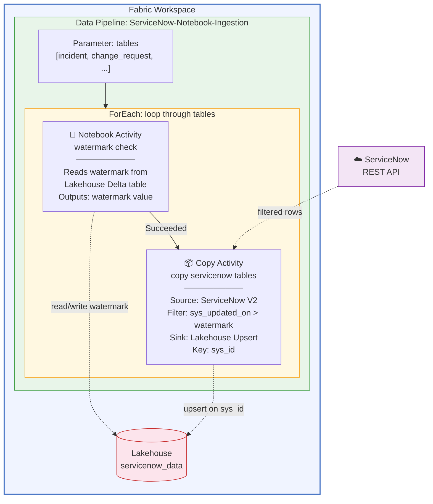

# ServiceNow → Microsoft Fabric Incremental Ingestion Pipeline (Notebook + Copy Activity)

Incremental ingestion from ServiceNow into a Fabric Lakehouse using a **hybrid Notebook + Copy Activity** pattern. A PySpark Notebook reads and updates watermarks in a Lakehouse Delta table, and a native Copy Activity moves data from ServiceNow with upsert into the Lakehouse.

**Notebook for watermark logic. Copy Activity for data movement. No SQL Database required. Two activities per table.**

---

## Architecture



### Pipeline Flow (per table, inside ForEach)

| Step | Activity | Duration | What It Does |
|---|---|---|---|
| 1 | **watermark check** (Notebook) | ~58s | Reads last watermark from Lakehouse Delta table, outputs value for Copy Activity |
| 2 | **copy servicenow tables** (Copy Activity) | ~35s | Copies rows from ServiceNow where `sys_updated_on > watermark`, upserts into Lakehouse on `sys_id` |

---

## How It Differs from the SQL Database Watermark Approach

This repo is one of two ServiceNow ingestion patterns. For the companion approach, see [fabric-pipeline-servicenow-incremental-refresh](https://github.com/claraworkman/fabric-pipeline-servicenow-incremental-refresh).

| Feature | This Repo (Notebook + Copy Activity) | Companion Repo (SQL Database + Copy Activity) |
|---|---|---|
| **Watermark storage** | Lakehouse Delta table | Fabric SQL Database |
| **Watermark logic** | PySpark Notebook | Lookup + Stored Procedure |
| **Data movement** | Copy Activity (ServiceNow V2 connector) | Copy Activity (ServiceNow V2 connector) |
| **Activities per table** | 2 (Notebook → Copy) | 3 (Lookup → Copy → Stored Procedure) |
| **Extra infrastructure** | None | SQL Database + stored procedure |
| **Customization** | Notebook code — fully extensible | Pipeline expressions only |
| **Compute** | Spark session (~58s startup) + pipeline runtime | Pipeline runtime only |
| **Best for** | Teams comfortable with PySpark, want extensibility | Teams wanting pure low-code, fastest execution |

---

## Prerequisites

| Requirement | Details |
|---|---|
| **Fabric workspace** | With F64 or higher capacity attached |
| **Fabric Lakehouse** | Will be created during setup (e.g., `servicenow_data`) |
| **ServiceNow instance** | Developer or production instance with REST API access |
| **ServiceNow auth** | Service account with Basic authentication |
| **Workspace role** | Contributor or higher |

---

## Deployment

> **At a glance — 5 steps:**
> 1. Create a Fabric workspace and Lakehouse
> 2. Create the watermark notebook
> 3. Create the data pipeline with ForEach → Notebook → Copy Activity
> 4. Create the ServiceNow connection
> 5. Test the pipeline

### Step 1: Create a Fabric workspace and Lakehouse

1. Go to [app.fabric.microsoft.com](https://app.fabric.microsoft.com) → **Workspaces** → **+ New workspace**
2. Name it (e.g., `ServiceNow-Notebook-Ingestion`)
3. Assign a Fabric capacity (F64 or higher)
4. Inside the workspace, click **+ New item** → **Lakehouse** → name it `servicenow_data`

### Step 2: Create the watermark notebook

The notebook handles reading and updating watermarks in a Lakehouse Delta table.

1. In the workspace, click **+ New item** → **Notebook**
2. Name it `watermark-check`
3. Attach it to the `servicenow_data` Lakehouse (click **Lakehouses** in the left panel → **Add** → select `servicenow_data`)
4. Add the following cells:

#### Cell 1 — Parameters

```python
# Parameters (overridden by pipeline)
table_name = "incident"
```

> **Note:** When triggered by the pipeline, `table_name` is automatically set to the current table from the ForEach loop.

#### Cell 2 — Read watermark from Lakehouse

```python
from pyspark.sql import SparkSession

spark = SparkSession.builder.getOrCreate()

# Read current watermark for this table
try:
    watermark_df = spark.sql(f"""
        SELECT watermark_value 
        FROM watermark_tracking 
        WHERE table_name = '{table_name}'
    """)
    if watermark_df.count() > 0:
        watermark = watermark_df.collect()[0]["watermark_value"]
    else:
        watermark = "1970-01-01 00:00:00"
except Exception:
    # Table doesn't exist yet (first run)
    watermark = "1970-01-01 00:00:00"

print(f"Table: {table_name}, Watermark: {watermark}")
```

#### Cell 3 — Output watermark for Copy Activity

```python
# Output the watermark value so the pipeline can use it
# The Copy Activity references this via: @activity('watermark check').output.result.exitValue
from notebookutils import mssparkutils

mssparkutils.notebook.exit(watermark)
```

#### Cell 4 — Update watermark after successful copy

> **Important:** This cell should be called *after* the Copy Activity succeeds. You can either:
> - Include the update logic in this notebook and call it a second time with a "mode" parameter, or
> - Create a separate small notebook for the watermark update step

```python
from datetime import datetime
from pyspark.sql.types import StructType, StructField, StringType
from delta.tables import DeltaTable

new_watermark = datetime.utcnow().strftime("%Y-%m-%d %H:%M:%S")

watermark_data = [(table_name, new_watermark)]
watermark_schema = StructType([
    StructField("table_name", StringType(), False),
    StructField("watermark_value", StringType(), False)
])
new_watermark_df = spark.createDataFrame(watermark_data, watermark_schema)

if spark.catalog.tableExists("watermark_tracking"):
    delta_wm = DeltaTable.forName(spark, "watermark_tracking")
    delta_wm.alias("target").merge(
        new_watermark_df.alias("source"),
        "target.table_name = source.table_name"
    ).whenMatchedUpdate(
        set={"watermark_value": "source.watermark_value"}
    ).whenNotMatchedInsertAll(
    ).execute()
else:
    new_watermark_df.write.format("delta").saveAsTable("watermark_tracking")

print(f"Watermark updated: {table_name} → {new_watermark}")
```

### Step 3: Create the data pipeline

1. In the workspace, click **+ New item** → **Data Pipeline**
2. Name it `ServiceNow-Notebook-Ingestion`

#### Add the pipeline parameter

- Name: `tables`
- Type: Array
- Default: `[{"tableName": "incident"}]`

#### Add the ForEach activity

1. Drag a **ForEach** activity onto the canvas
2. Name it `loop through tables`
3. **Settings** → Items: `@pipeline().parameters.tables`
4. Click the **pencil icon** (✏️) to open the ForEach canvas

#### Inside the ForEach — add the Notebook activity

1. Drag a **Notebook** activity onto the ForEach canvas
2. Name it `watermark check`
3. **Settings**:
   - Notebook: select `watermark-check`
   - Base parameters → **+ New**:
     - Name: `table_name`
     - Type: String
     - Value: `@item().tableName`

#### Inside the ForEach — add the Copy Activity

1. Drag a **Copy Data** activity onto the ForEach canvas
2. Name it `copy servicenow tables`
3. Connect `watermark check` → `copy servicenow tables` (drag the green arrow)
4. **Source** tab:
   - Connection: Create or select your ServiceNow connection
   - Table: select `incident` (will be overridden by expression)
   - Filter: Add a filter expression for incremental:
     - Field: `sys_updated_on`
     - Operator: `>=`
     - Value: `@activity('watermark check').output.result.exitValue`
5. **Destination** tab:
   - Connection: select your `servicenow_data` Lakehouse
   - Table: `@item().tableName`
   - Table action: **Upsert**
   - Key columns: `sys_id`

### Step 4: Create the ServiceNow connection

1. In the Copy Activity **Source** tab, click the connection dropdown → **+ New connection**
2. Configure:

| Field | Value |
|---|---|
| **Connection name** | `ServiceNow-Connection` |
| **Server URL** | `https://<your-instance>.service-now.com` |
| **Authentication** | Basic |
| **Username** | Your ServiceNow service account |
| **Password** | Service account password |

### Step 5: Test

1. First, initialize the watermark table by running the notebook manually once
2. Click **Run** on the pipeline
3. First run → full load (all rows from ServiceNow)
4. Second run → **0 rows copied** (incremental working)
5. Update a record in ServiceNow → third run picks up the changed row

---

## Initialize the Watermark Table

Before the first pipeline run, create the watermark tracking table. Run this in a notebook cell:

```python
from pyspark.sql.types import StructType, StructField, StringType

schema = StructType([
    StructField("table_name", StringType(), False),
    StructField("watermark_value", StringType(), False)
])

initial_data = [("incident", "1970-01-01 00:00:00")]
df = spark.createDataFrame(initial_data, schema)
df.write.format("delta").saveAsTable("watermark_tracking")
```

---

## Scaling to Multiple Tables

### 1. Seed additional watermarks

```python
from pyspark.sql.types import StructType, StructField, StringType

new_tables = [
    ("change_request",  "1970-01-01 00:00:00"),
    ("cmdb_ci_server",  "1970-01-01 00:00:00"),
    ("sc_request",      "1970-01-01 00:00:00"),
    ("sys_user",        "1970-01-01 00:00:00"),
    ("problem",         "1970-01-01 00:00:00"),
]

schema = StructType([
    StructField("table_name", StringType(), False),
    StructField("watermark_value", StringType(), False)
])

df = spark.createDataFrame(new_tables, schema)
df.write.format("delta").mode("append").saveAsTable("watermark_tracking")
```

### 2. Update the pipeline parameter

```json
[
  {"tableName": "incident"},
  {"tableName": "change_request"},
  {"tableName": "cmdb_ci_server"},
  {"tableName": "sc_request"}
]
```

### 3. Run

The ForEach executes all tables in parallel by default. Each table runs its own Notebook → Copy Activity chain independently.

---

## Key Design Decisions

### Why Notebook + Copy Activity (hybrid)?

- **Notebook for watermarks** — The Lakehouse Lookup activity only supports Table mode (T-SQL Query is greyed out), so you can't run parameterized watermark queries with a Lookup. The notebook gives full Spark SQL access to read/write watermarks from a Delta table.
- **Copy Activity for data** — The native ServiceNow V2 connector handles authentication, pagination, and schema mapping automatically. No need to reimplement REST API calls in PySpark.

### Why not a SQL Database for watermarks?

This pattern keeps everything in the Lakehouse — no extra SQL Database to provision, no stored procedures to maintain. The trade-off is Spark session startup time (~58s vs. ~instant for a SQL Lookup).

### Why Upsert on sys_id?

ServiceNow records can be updated. Using Append would create duplicate rows. Upsert performs a MERGE on `sys_id`, so:
- New records are inserted
- Modified records are updated in-place
- No duplicates

---

## Scheduling

Add a schedule trigger in the pipeline toolbar:

| Use Case | Recommended Frequency |
|---|---|
| Real-time ops dashboard | Every 15–30 minutes |
| Daily reporting | Once daily (e.g., 6:00 AM) |
| Weekly analytics | Once weekly |
| Development/testing | Manual trigger only |

---

## Troubleshooting

| Issue | Fix |
|---|---|
| Notebook output not accessible by Copy Activity | Use `mssparkutils.notebook.exit(watermark)` — Copy reads via `@activity('watermark check').output.result.exitValue` |
| Lakehouse Lookup query greyed out | This is why we use a Notebook instead of a Lookup for watermark reads |
| Copy reads all rows every run | Verify Source filter uses the notebook output watermark expression |
| Spark session slow to start | Normal — first cell takes 30–60s for Spark initialization |
| Duplicate records | Ensure Destination table action is **Upsert** with key column `sys_id` |
| Watermark table doesn't exist | Run the initialization cell manually before the first pipeline run |
| ServiceNow connection fails | Check URL format (`https://<instance>.service-now.com`), auth type (Basic), account not locked |
| `InvalidTemplate` / `firstRow` doesn't exist | This error occurs with the SQL Database Lookup approach — not applicable to this notebook pattern |

---

## Useful Commands

```python
# Check all watermarks
display(spark.sql("SELECT * FROM watermark_tracking ORDER BY watermark_value DESC"))

# Reset a single table watermark (triggers full reload)
spark.sql("""
    UPDATE watermark_tracking 
    SET watermark_value = '1970-01-01 00:00:00' 
    WHERE table_name = 'incident'
""")

# Reset all watermarks
spark.sql("UPDATE watermark_tracking SET watermark_value = '1970-01-01 00:00:00'")

# Check row counts per table
for table in ["incident", "change_request", "cmdb_ci_server"]:
    try:
        count = spark.sql(f"SELECT COUNT(*) as cnt FROM {table}").collect()[0]["cnt"]
        print(f"{table}: {count} rows")
    except:
        print(f"{table}: not yet created")
```

---

## Related

- **SQL Database watermark approach (3 native activities, no notebooks):** [fabric-pipeline-servicenow-incremental-refresh](https://github.com/claraworkman/fabric-pipeline-servicenow-incremental-refresh)

---

## License

This project is provided as-is for demonstration and deployment purposes.
